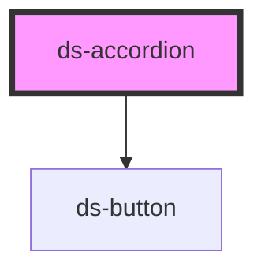

# ds-accordion

<!-- Auto Generated Below -->

## Properties

| Property      | Attribute      | Description | Type     | Default      |
| ------------- | -------------- | ----------- | -------- | ------------ |
| `buttonLabel` | `button-label` |             | `string` | `'Dropdown'` |
| `description` | `description`  |             | `string` | `undefined`  |

## Events

| Event    | Description | Type               |
| -------- | ----------- | ------------------ |
| `toggle` |             | `CustomEvent<any>` |

## Dependencies

### Depends on

- [ds-button](../ds-button)

### Graph

----------------------------------------------

*Built with [StencilJS](https://stenciljs.com/)*
