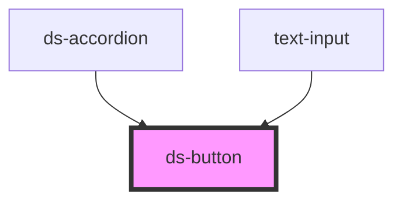

# ds-button

<!-- Auto Generated Below -->

## Properties

| Property   | Attribute  | Description                                    | Type                                     | Default     |
| ---------- | ---------- | ---------------------------------------------- | ---------------------------------------- | ----------- |
| `disabled` | `disabled` |                                                | `boolean`                                | `false`     |
| `label`    | `label`    |                                                | `string`                                 | `undefined` |
| `size`     | `size`     | Choose the size of the button                  | `"large" \| "small"`                     | `'large'`   |
| `type`     | `type`     | Which type of button to render                 | `"primary" \| "secondary" \| "tertiary"` | `'primary'` |
| `width`    | `width`    | Whether the button has fixed or autosized with | `"auto" \| "full"`                       | `undefined` |

## Dependencies

### Used by

 - [ds-accordion](../ds-accordion)
 - [text-input](../text-input)

### Graph

----------------------------------------------

*Built with [StencilJS](https://stenciljs.com/)*
